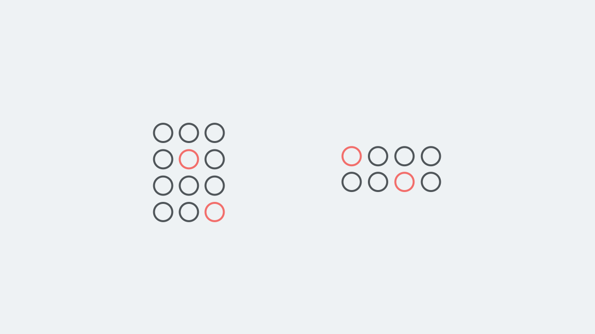

Without question, human psychology is an important aspect of design. To better create designs that people can understand or interact with, it helps to have an understanding of how the human mind works. If you think this only applies to user experience or interface design, think again.

In this article, I will discuss a specific school of psychology called **Gestalt Psychology**, and some of its underlying principles. These principles can be applied to many, if not all, design disciplines. Whether you are designing an interface for a complex piece of software, or designing a logo, you can apply these principles to produce more meaningful and understandable designs.

## What is Gestalt Psychology?

While the German word **gestalt** _(guh-shtaalt)_ has no direct english translation, it can be interpreted as "pattern", "configuration", or "form". As a discipline of psychology, it emerged in Austria and Germany in the 20th century. In a single sense, Gestalt psychology states that: "the whole of anything is greater than its parts." What? Basically, that implies that you can't understand a big complex thing just by looking at a tiny piece of it. You must look at everything as a whole, and see how all of those tiny pieces relate with one another before you can understand it in depth.

Imagine that you had no idea what a car was, and someone showed you a photo of a tire. Do you think that, based on that photograph, you would be able to deduce how a car worked, let alone what a car looked like? Probably not. I mean, I still don't even _really_ know how a car works, but I know enough to be able to identify a car, and the relationship between the major parts to make the driver go from A to B.

It's those relationships that we, as designers, must understand and emphasize through our design decisions to establish context and meaning. While Gestalt psychology has several disciplines and schools of thought, we will be looking at the **Principals of Grouping**, which define how humans process visual information into a set of laws. These laws will be the principles that I will discuss in this article.

## 1. Law of Proximity

Elements that have proximity (closeness to each other) are perceived to be related to each other, in comparison to other elements that may be separated. This is one of the many reasons why whitespace is such an important tool in the designer's toolkit. While often overlooked, spacing between certain elements can signify whether elements are related to each other or not.

Imagine that you are designing a user interface that displays blog posts that the user can edit, delete, and categorize as needed. The user would expect the controls to edit or delete a post to be close in proximity to where the post was displayed on the interface. It would also make sense to keep all of the posts within the same category together, and provide ample space separating the categories. This is only one example of the many ways you can apply the law of proximity to make informed design decisions.

## 2. Law of Similarity

Elements that share the same visual characteristics are perceived to have some degree of relationship, regardless of their proximity to one another. Some of these visual characteristics can be size, shape, or color. Color can be a really powerful tool to signify similarities and imply relationships. There's a term for this: color-coding. However, you should never rely on color alone, as approximately [4.5% of people suffer from color-blindness](http://www.colourblindawareness.org/colour-blindness/).

Let's say you are designing a website or flyer for a company. The design must contain the company's name, the services they offer, and some sort of call-to-action. Each service has a name, and a short paragraph that explains how it can help the client. Because the services all share a common relationship (they are all services together), they should all have very similar appearances, such as font-weight and color. Each service's content is different, but by sharing visual characteristics, it suggests to the reader that they are all services.

## 3. Law of Closure

Individuals perceive objects, patterns, or forms as being whole even when they are not complete, so long as we are familiar with said object, pattern, or form. This basically implies that even if we are presented with a visual element that is not complete, our mind can do a pretty good idea with filling in the gaps if it has the means to do so based on previous experiences.

These patterns aren't limited specifically to actual visual patterns, but **design patterns** as well. In today's day and age, people have grown accustomed to using technology. There now exists a myriad of conventions, sometimes referred to as design patterns. These design patterns are expectations that the user has in regards to the technology that they are using.

For instance, let's say you're using an app, and a little window pops up. There's an "×" in the upper-left hand corner of the window. It doesn't say what it does, because it doesn't need to. You know what it does. That's why I'm not even going to say what it does, because you already know. This is an example of your brain filling in the gaps, based on your familiarity with these patterns.

As designers, not only are we able to understand these expectations, but it's become almost a necessity to follow them as closely as possible. If you want to break these conventions that users have grown accustomed to, you better have a good reason, and an even better alternative. Nothing frustrates users more than technology that doesn't behave the way they expect it to.

## 4. Law of Symmetry

Individuals are able to determine whether or not an object or arrangement of objects is symmetrical/asymmetrical in nature. Oxford Dictionary defines symmetry as: "the quality of being made up of exactly similar parts facing each other or around an axis." This axis can either be vertical (such as in the example above), horizontal, or diagonal. If an arrangement of objects is determined to be symmetrical, we often associate those objects as having a relationship with one another.

Generally speaking, people prefer symmetry. It helps provide a sense of organization and visual harmony. However, don't feel like you need to make all of your designs completely symmetrical. Asymmetry can create very interesting and compelling results. The real goal should be to find balance. Asymmetry can also be a great way to direct your user or reader's attention to a specific element within your design. That is why you often see banners or ads presented in an asymmetrical fashion to an otherwise symmetrical page layout.

## 5. Law of Figure-Ground Perception

People are able to separate objects or figures from the background they are imposed over. In fact, this perception is one of the first visual perceptual abilities to [develop in babies and toddlers](https://www.educanda.co.za/news/early_learning_figure_ground_development_in_babys_and_toddlers).

Not only can this perception be applied to create visually interesting designs, but it can also serve as a way to draw attention to a specific design element, or group elements together. Most, if not all, design creation tools provide some form of ordering elements on the z axis. Examples include the z-index CSS property, or Layers that can be found in most popular design softwares. Other additional effects can be added such as drop shadows and varying levels of opacity to signify depth in a typically two-dimensional medium like print or screen design.

Like most of these design principles, there are some things to be aware of. You never want the figure in the foreground to compete with the background. You should ensure you have enough contrast between the background and foreground to avoid conflicts. Conflict between foreground elements and their background can also create optical illusions. When done intentionally, it can create some [very compelling results](https://www.google.com/search?q=figure+ground+optical+illusions&sxsrf=ALeKk00gxEwZ55axEdMafwOsSWhFltq1FA:1586468983036&source=lnms&tbm=isch&sa=X&ved=2ahUKEwix6bjBqdzoAhVPtZ4KHUKZBDYQ_AUoAXoECBAQAw&biw=2560&bih=1361).

## 6. Law of Continuation

Individuals have the tendency to group together elements presented in a continuous form, such as in a linear direction. Even if two linear forms exist, and they overlap, we are still able to process and continuously follow the line even past the intersection of the two lines.

While tend to associate elements presented along the same line as having a relationship. There are lots of examples of this in modern web design and UI/UX design. Dropdown lists. Links in a navbar. Items in a row or column. We tend to group these together because they follow the same linear axis, whether they are presented from left-to-right or top-to-bottom.

Lines can be actual lines, or they can be implied. Consider a large block of text, such as the one you are reading right now. If you are reading this in the western part of the world that reads from left to right, look at the left side of the text block. It's a straight albeit implied line. This technique has been used for centuries to help guide the reader's eyes down the page. Similarly, we as designers can use either real or implied lines to direct attention as we deem necessary.

## 7. Law of Common Fate

People perceive objects that move together in the same direction as being related to each other. The most common example for this is a big flock of birds or a school of fish. We typically look at these forms in nature as one giant, moving mass instead of focusing on each individual member of the group, at least at first. The one bird or fish that moves astray always seems to catch our attention.

If your chosen design medium allows you to add movement, animation, or motion, then this is an additional concept that you can apply to convey relationships between elements. Motion and animation can be a very powerful tool for a variety of situations, but make sure you use it sparingly. Too much motion can create a distressing design that drives users away.

## Recap

You may have noticed a trend in all of these principles. They can all be applied to establish (or diminish) relationships between visual elements, or direct attention to a specific element. Regardless of what your intended outcome may be, you may find yourself using a combination of all of these principles in some shape or form to develop a cohesive visual hierarchy in your designs. Once again, those principles are:

**1. Law of Proximity**

**2. Law of Similarity**

**3. Law of Closure**

**4. Law of Symmetry**

**5. Law of Figure-Ground Perception**

**6. Law of Continuation**

**7. Law of Common Fate**

I plan to expand on some of these topics in the future, such as how to apply some of these principles to ensure that your designs are accessible and usable by everyone. If you'd like to keep up with what's going on in my world, feel free to give me a follow on [Twitter](https://twitter.com/jackgannon_). Until next time!
